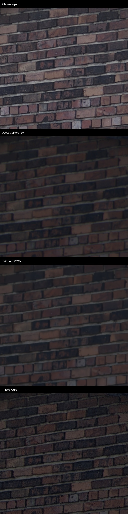

# hiraco

`hiraco` is a standalone C++ pipeline designed to convert select Olympus / OM System High-Resolution sensor-shift `.ORF` raw files into robust, exceptionally detailed Linear DNG files. 

By deeply analyzing the sensor-shift characteristics of these cameras, `hiraco` operates a specialized custom native reconstruction engine to extract true sub-pixel resolution rather than relying on mathematically standard interpolations. It specifically targets the full optical extraction of High-Res composites.

Project was developed exclusively using Claude 4.6 / GPT 5.4 / Gemini 3 with analysis of TIFF and ORI/ORF files and metadata only. No code decompilation or other techniques were used.

## Unrivaled Detail Retention

`hiraco` rivals and out-performs commercial converters in resolving fine spatial details from the sensor-shift data. Our native FFTW deconvolution mapping successfully retrieves the crisp architecture edges originally captured by the lens.



*(Comparison of identical high-res Olympus raw exported across top commercial engines vs `hiraco`)*

## Current status
The project offers fully working conversion paths for standard and high-resolution camera payloads.
Features include:
- Pure C++ native pipeline.
- Native decoding of High Resolution payload structures via MakerNote parsing.
- **Advanced Deconvolution Pipeline**: Resolving the hardware Point Spread Function (PSF) blurring innate to multi-shot sensor shifts utilizing `FFTW`.
- Corrected radiometrics: Black-level and color neutralizing alignments mapped to proper EXIF bounds, neutralizing historically notorious color-cast display issues in third-party viewers.
- Native `Adobe DNG SDK` integration for final negative assembly supporting `uncompressed`, `deflate`, and modern `jpeg-xl` DNG matrices via DNG version `1.6.0.0` and `1.7.1.0`.

## Dependencies

`hiraco` requires the following dependencies:
- **CMake** (v3.16+)
- **LibRaw**
- **FFTW3**
- **Adobe DNG SDK 1.7.1** (Manual installation required)

### 1. The Adobe DNG SDK (All Platforms)
The Adobe DNG SDK is a required manual dependency for the native packaging path. It cannot be redistributed in this repository. Before building, ensure you have placed the Adobe DNG SDK bundle folder into `dng_sdk_1_7_1/` inside the workspace root.

### 2. Native Prerequisites

**macOS (via Homebrew)**
```bash
brew install cmake libraw fftw pkg-config
```

**Linux (Debian/Ubuntu, experimental not tested)**
```bash
sudo apt update
sudo apt install build-essential cmake libraw-dev libfftw3-dev pkg-config zlib1g-dev
```

**Windows (via vcpkg, experimental not tested)**
```powershell
# Assumes vcpkg is installed and bootstrapped
vcpkg install libraw fftw3 zlib:x64-windows
```

## Building from source

You can configure and build the standalone C++ binary out-of-source:

**macOS & Linux**
```bash
mkdir bin
cd bin
cmake -DCMAKE_BUILD_TYPE=Release ..
make -j
```
The resulting binary will be output locally at `bin/hiraco`.

**Windows**
```powershell
mkdir build
cd build
cmake -DCMAKE_TOOLCHAIN_FILE="C:/path/to/vcpkg/scripts/buildsystems/vcpkg.cmake" -DCMAKE_BUILD_TYPE=Release ..
cmake --build . --config Release
```
The resulting binary will be output locally at `build\Release\hiraco.exe`.

## Usage

You can use the native binary directly from the terminal to process your conversions. The converter writes a Rendered Linear RGB DNG, providing software with a clean, high-bit-depth image ready for baseline color and tonal manipulation.

Convert utilizing uncompressed arrays or standard Deflate/JPEG-XL compression:

```bash
# Convert to Uncompressed 16-bit Linear DNG
./bin/hiraco convert _3210505.ORF output.dng --compression uncompressed

# Convert using compression paths
./bin/hiraco convert _3210505.ORF output.dng --compression deflate
./bin/hiraco convert _3210505.ORI output.dng --compression jpeg-xl
```

## Repository notes

- The project relies heavily upon the Adobe DNG SDK for constructing the final negative container. It is not included and must be sourced from Adobe's developer distribution.
- The pipeline previously consisted of a Python wrapper calling into a C++ helper, but has now been fully ported to a singular native C++ implementation (`hiraco`).


## Legal Disclaimer
*OM SYSTEM and Olympus are registered trademarks of OM Digital Solutions Corporation or Olympus Corporation. This open source project is not affiliated with, endorsed by, or sponsored by these companies. All trademarks are used for compatibility description and nominative fair use purposes only.*
