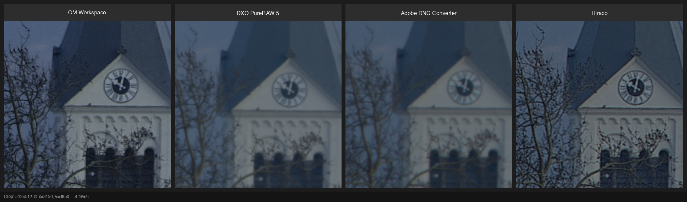
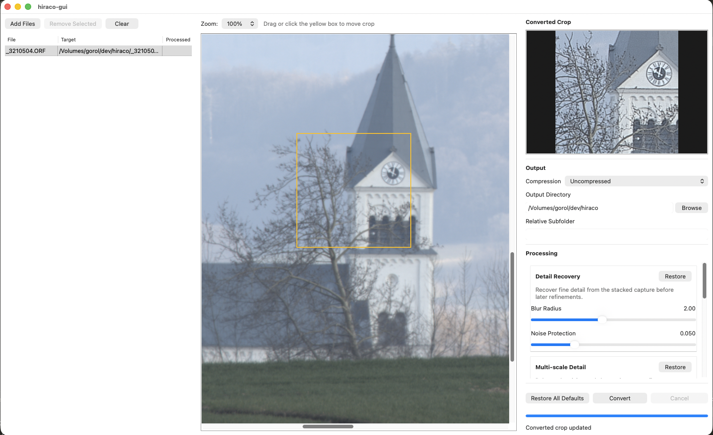

# hiraco

`hiraco` is a native C++ toolchain for converting selected Olympus / OM SYSTEM RAW files, with a custom emphasis on high-resolution sensor-shift captures, into rendered Linear DNG files.

The repository builds one shared processing core and exposes it through two frontends:
- `hiraco-cli` for command-line conversion
- `hiraco-gui` for interactive preview, tuning, and batch conversion

The current implementation supports both a custom high-resolution raw-domain reconstruction path and a LibRaw-based render path for other supported inputs.

## GUI



## What The Project Currently Provides

- `hiraco-core`: shared static library containing preparation, metadata, preview, crop-preview, enhancement, and DNG writing code.
- `hiraco-cli`: command-line `convert` frontend.
- `hiraco-gui`: wxWidgets desktop frontend with queueing, preview, crop inspection, output controls, and conversion.
- Custom high-resolution raw-domain reconstruction driven by vendor metadata and stack-guidance maps.
- Rendered Linear DNG output with `uncompressed`, `deflate`, and `jpeg-xl` compression modes.
- Three user-facing processing control groups in the GUI:
  - `Detail Recovery`
  - `Multi-scale Detail`
  - `Edge Refinement`
- Cached original preview rendering and processing-cache reuse for fast converted crop inspection in the GUI.
- Optional timing output for performance work via `--debug` or `HIRACO_TIMING=1`.

## Supported Workflows

- Convert `.ORF` and `.ORI` sources to rendered Linear DNG.
- Open the GUI, inspect the original preview, and move a crop box over the image.
- Inspect a live converted crop preview while adjusting processing controls.
- Queue multiple files, choose an output directory and relative subfolder, and batch convert them.

The strongest custom path in the repository today is the high-resolution workflow. Standard sources still go through the shared core, but the specialized raw-domain reconstruction is targeted at the  high-resolution capture format.

## Requirements

`hiraco` currently expects:

- CMake 3.28+
- LibRaw
- FFTW3 and `fftw3_threads`
- Halide
- Zlib
- OpenMP (optional but strongly recommended)
- wxWidgets (for `hiraco-gui`)
- Adobe DNG SDK 1.7.1 bundle unpacked into `dng_sdk_1_7_1/`

The repository also expects the bundled Adobe libjxl and XMP toolkit that ship with the DNG SDK bundle under `dng_sdk_1_7_1/`.

### macOS

```bash
brew install cmake libraw fftw halide libomp pkg-config wxwidgets
```

### Linux (Debian/Ubuntu)

```bash
sudo apt update
sudo apt install build-essential cmake libraw-dev libfftw3-dev libhalide-dev libomp-dev pkg-config zlib1g-dev libwxgtk3.2-dev
```

### Windows (vcpkg)

```powershell
vcpkg install libraw fftw3 halide zlib wxwidgets:x64-windows
```

## Building

### Configure And Build

```bash
cmake -S . -B build -DCMAKE_BUILD_TYPE=Release
cmake --build build -j
```

This produces:

- `build/hiraco-cli`
- `build/hiraco-gui`
- `build/libhiraco-core.a`

If `wx-config` is not on `PATH` on macOS, point CMake at it explicitly:

```bash
cmake -S . -B build \
  -DCMAKE_BUILD_TYPE=Release \
  -DwxWidgets_CONFIG_EXECUTABLE="$(brew --prefix wxwidgets)/bin/wx-config"
cmake --build build -j
```

### Useful Build Switches

```bash
cmake -S . -B build -DHIRACO_BUILD_GUI=OFF
cmake -S . -B build -DHIRACO_BUILD_CLI=OFF
cmake -S . -B build -DHIRACO_BUILD_TESTS=ON
```

## Running

### CLI

The CLI currently exposes one command:

```bash
./build/hiraco-cli convert <source> <output> [--compression uncompressed|deflate|jpeg-xl] [--debug]
```

Examples:

```bash
./build/hiraco-cli convert _3210505.ORF output.dng --compression uncompressed
./build/hiraco-cli convert _3210505.ORF output.dng --compression deflate
./build/hiraco-cli convert _3210505.ORI output.dng --compression jpeg-xl --debug
```

`--debug` enables timing logs for the main processing phases.

### GUI

```bash
./build/hiraco-gui
```

The GUI currently supports:

- Adding files with a button or drag-and-drop
- Per-file queueing and processed-state feedback
- Original preview with `Fit`, `25%`, `50%`, and `100%` zoom modes
- A movable crop box with live converted crop preview
- Compression and output-path configuration
- Interactive processing controls for detail recovery, multi-scale detail, and edge refinement
- Overwrite prompts, progress reporting, and cancellation

## Tests

If tests are enabled, the repository builds `hiraco-core-tests`:

```bash
cmake -S . -B build -DHIRACO_BUILD_TESTS=ON
cmake --build build --target hiraco-core-tests
ctest --test-dir build --output-on-failure
```

The test target currently covers core-library behavior rather than full GUI automation.

## Processing Notes

At a high level, the current pipeline is:

1. Inspect the source with LibRaw and build reusable base metadata.
2. Lazily enrich that metadata with vendor MakerNote and stack-guidance data when needed.
3. Render either:
   - a cached original preview,
   - a cached converted crop preview, or
   - a full rendered Linear DNG payload.
4. Apply enhancement stages when the source metadata requests predicted detail gain.
5. Package the final rendered image through the Adobe DNG SDK.

See [algorithm.md](algorithm.md) for the current implementation-level processing description.

## Legal Disclaimer

*OM SYSTEM and Olympus are registered trademarks of OM Digital Solutions Corporation or Olympus Corporation. This project is not affiliated with, endorsed by, or sponsored by these companies. All trademarks are used only for compatibility description and nominative fair use purposes.*
